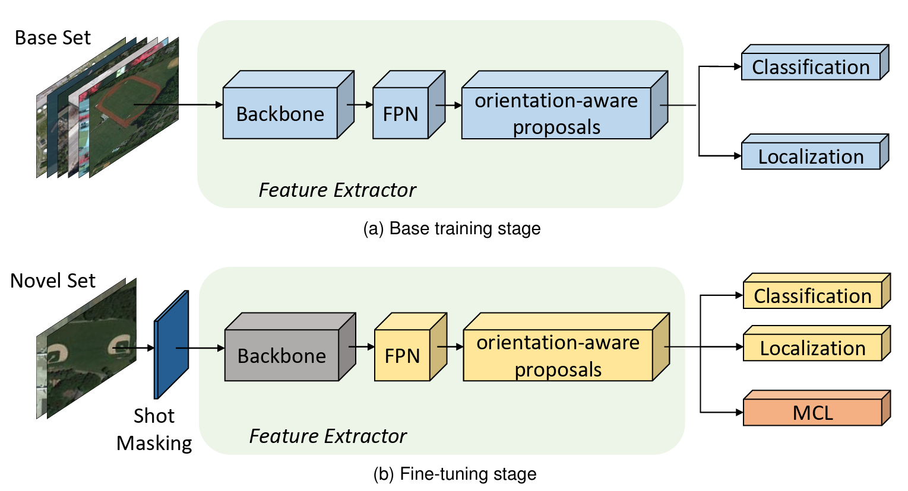

<font size='5'>**Few-Shot Oriented Object Detection in Remote Sensing Images via Memorable Contrastive Learning**</font>

Jiawei Zhou, Wuzhou Li, Yi Cao, Hongtao Cai, Xiang Li*

<a href='https://github.com/BriFuture/fomc'></a> <a href='https://arxiv.org/abs/2403.13375'></a>


This repository contains official code of Few-Shot Oriented Object Detection in Remote Sensing Images via Memorable Contrastive Learning (FOMC). 

# FOMC
<center>
    
</center>

Our FOMC employs oriented bounding boxes instead of horizontal ones to learn superior feature representations for arbitrarily oriented aerial objects, enhancing detection accuracy. FOMC uses a two-stage training paradigm following TFA. An MCL module is designed to store encoded proposal features for contrastive learning and encourage the model to learn class distinctive features, along with a a simple and effective instance masking module to eliminate the confusion caused by unselected instances. 

## Installation

The framework is based on [mmcv](https://github.com/open-mmlab/mmcv), [mmdetection](https://github.com/open-mmlab/mmdetection), and [mmrotate](https://github.com/open-mmlab/mmrotate). However, the `mmcv.ops` have been integrated into `gdet/ops` folder, the `mmdetection` and `mmrotate` libraries have been integrated into the root directory of this repository. So there is no need for additional installation steps. Follow the instructions below to install and run the code.

Install required libraries.

```bash
1. pip install -r requirements.txt
2. pip install torch==2.2.1 torchvision==0.17.1 torchaudio==2.2.1 --index-url https://download.pytorch.org/whl/cu121
3. python setup.py develop
```

## Experiments
Check [REPRODUCE.md](REPRODUCE.md) for details to reproduce experiments.


## 📜 Citation

```bibtex
@article{zhou2024few,
  title={Few-shot Oriented Object Detection with Memorable Contrastive Learning in Remote Sensing Images},
  author={Zhou, Jiawei and Li, Wuzhou and Cao, Yi and Cai, Hongtao and Li, Xiang},
  journal={arXiv preprint arXiv:2403.13375},
  year={2024}
}
```

## 🙏 Acknowledgement
Our FOMC method is based on [TFA](https://arxiv.org/abs/2003.06957).

We are thankful to [MMRotate](https://github.com/open-mmlab/mmrotate), [MMDetection](https://github.com/open-mmlab/mmdetection) for releasing their models and code as open-source contributions.